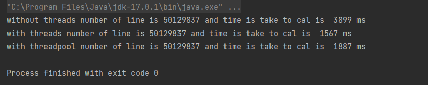
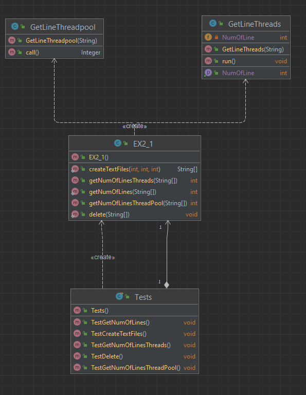

# OOP Assignment 2
Assignment 2 for the course Object-Oriented Programming by Roy Wasker and Yuval Dahan.

##  Overview

In part A we created several text files and calculated the total number of lines in these files.<br>
in three methods : <br>
• Normal method without using Threads<br>
• Using Threads<br>
• Using ThreadPool<br>

In part B we created ThreadPool that is implemented on a priority queue ,<br> 
in addition to each task submitted to the queue you can receive the task's result.

## Part A

In this part we created 3 departments to perform the task,
Class EX2_1 in which there are several methods that create several text files at the user's request and writes a number of lines to each file randomly according to the input from the user.
3 methods that receive an array of file names and calculate the total number of lines in the files in the three methods: without trads, with trads and with ThreadPool.<br>
And finally a method that will delete all the created files.

<br>
GetLineThreads class that extends from the Thread class and contains 2 variables, the array of names and an integer that returns the number of lines.<br>
And a run method that calculates the number of lines in files with Threads.<br><br>

GetLineThreadpool class that implements Callable <Integer> and contains 2 variables, the array of names and an integer that returns the number of lines.<br>
And a call method that calculates the number of lines in files with ThreadPool and return and result.<br><br>

In addition, we write a test class to compare the times of performing the calculation in the three methods.<br><br><br>
Attached is a picture of the calculation and times for each of the three methods :




According to the times we can see threads is the fastest, followed by a relatively small difference the ThreadPool and finally the method without threads.

Attached is a picture of the UML diagram :




#### Clone the repositorty
Enter your IDE and clone the repository:
  ```sh
  git clone https://github.com/roywasker/OOP_EX2.git
  ```
